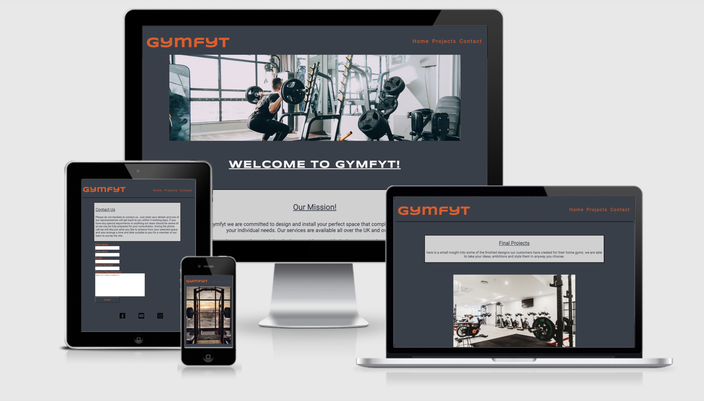

# gymfyt 

## Introduction

### My-project-portfolio-one

gymfit is an online based company dedicated to designing and installing the perfect workout space for their customers in whatever size space they have available.

The client has asked for an interactive/responsive website to be built to further grow their business and expand their clientel.

Due to the Covid Pandemic, all Gym and outdoor excersise equipment saldy had to close. So gymfyt saw this as the perfect oppurtunity for a new start up business.

[live website](https://ronnietyler.github.io/Portfolio-Project-One/)

## Table of contents

1. [Wireframes](#wireframes)
    * [Mobile Version](#mobile-version)
    * [Homepage](#homepage)
    * [About](#about)
    * [Contact](#contact)
2. [Features](#features) 
3. [Design](#design)
    * [Goals](#goals)
    * [Expectations](#expectations)
4. [Testing](#testing)
5. [Technology used](#technology-used)
6. [Credits](#credits)

## Wireframes

### Mobile Version

### Homepage

### About

### Contact

## Features 

### Consistent Logo Nav Bar and Footer

 * Across all three pages the Header, Logo, Nav Bar and Footer stay consistent throughout i wanted to do this to provide visual aesthetic and solid structure to the website.
 * The Logo has a link to connect you back to the Home page on all pages. and the Social Links at the Footer are fully functional and serve purpose to the site.
 
 
 

 ### Hero Images

  * Hero image changes when max screen width goes below 750px i added this feature to better display the image and draw the attention of the veiwer to make sure the websites intent was understood.

  
    

  ### About Page

   * I used this page to display Images of Projects already created by gymfyt for their customer base. Along side this, text explaining what was included plus what was needed from the space available and also a final price of how much it cost to build the Project.

   

