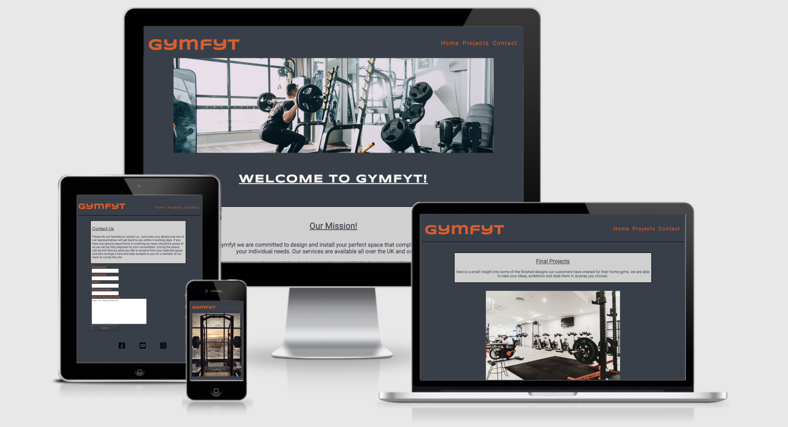

# gymfyt 

## Introduction

### My-project-portfolio-one

gymfit is an online based company dedicated to designing and installing the perfect workout space for their customers in whatever size space they have available.

The client has asked for an interactive/responsive website to be built to further grow their business and expand their clientel.

Due to the Covid Pandemic, all Gym and outdoor excersise equipment saldy had to close. So gymfyt saw this as the perfect oppurtunity for a new start up business.

[live website](https://ronnietyler.github.io/Portfolio-Project-One/)

## Table of contents

1. [Wireframes](#wireframes)
    * [Mobile Version](#mobile-version)
    * [Homepage Wireframe](#homepage)
    * [About Wireframe](#about)
    * [Contact Wireframe](#contact)
2. [Features](#features)
    * [Logo Nav Bar and Footer](#logo-nav-bar-and-footer)
    * [Hero Images](#hero-images)
    * [About](#about)
    * [Contact](#contact)
3. [Design](#design)
    * [Expectations](#expectations)
4. [Testing](#testing)
    * [Index-html](#index-html)
    * [About-html](#about-html)
    * [Contact-html](#contact-html)
    * [Style-css](#style-css)
5. [Technology used](#technology-used)
6. [Credits](#credits)

## Wireframes

### Mobile Version

### Homepage Wireframe

### About Wireframe

### Contact Wireframe

## Features 

### Logo Nav Bar and Footer

* Across all three pages the Header, Logo, Nav Bar and Footer stay consistent throughout i wanted to do this to provide visual aesthetic and solid structure to the website.
* The Logo has a link to connect you back to the Home page on all pages. and the Social Links at the Footer are fully functional and serve purpose to the site.
 
 
 

 ### Hero Images

* Hero image changes when max screen width goes below 750px i added this feature to better display the image and draw the attention of the veiwer to make sure the websites intent was understood.

  
    

  ### About

* I used this page to display Images of Projects already created by gymfyt for their customer base. Along side this, text explaining what was included plus what was needed from the space available and also a final price of how much it cost to build the Project.

   

   ### Contact

* On this page i placed a simple text box instructing clients to get in touch by filling in the form with there personal details. Also a text area for any special requirements like specific activities they want or disabilties they had. I wanted to make it a face to face consultation so the customer really felt like gymfyt had there best interests at heart.

## Design

* The initial design for the gymfyt website was to ensure it was completely responsive across all devices, which is why from the get go it was created to fit a mobile screen. I also wanted to make sure thay every peice of information on the site was necessary and relevant to the user, due to working with a smaller amount of space. 

* The color scheme used was a vibrant orange to show active, playful, energetic, happiness and confidence in the web page the dark grey was used as a contempary modern feel to show professionalism. I have used the sma ecolors throughout the webpage to keep things simple but elegant. Inside the text boxes an off-white light grey was used as to not be to harsh on the eyes and make for an easy enjoyable read.

* The font i used ROBOTO from google fonts is an easy to read uncomplicated font i kept the same font throughout as to not leave the user feeling confused or lost when navigating the site. The only other font used was SYNCOPATE for the logo a futuristic font ideal for the impression i wanted it to give. 

### Expectations

* The client has asked that the bacis capabilties for the website are.
* An eye catching home page with Hero image instantly depicitng what the site is about
* An About/Projects page to show site users examples of previous works.
* A collection of photos of each of the previous projects.
* A simple and clear form specifically designed to allow gymfyt to contact users once details have been entered.
* The ability to expand the site further in the future of individual excersise equipment available.
* Also future expansion of allowing clients to design their space virtually to show what is acheivable.

* The client wanted to express the look of a professional elegant committed site to achieve one final goal and that is to create safisticated engineered workout spaces suitbale for anyone and evryone.

## Testing

### Index-html

### About-html

### Contact-html

### Style-css

## Technology used

* [HTML5](https://en.wikipedia.org/wiki/HTML5) was used for the site markup
* [CSS3](https://en.wikipedia.org/wiki/CSS#CSS_3) was used to style the HTML
* [Balsamiq](https://balsamiq.com/) was used to produce the site wireframes
* [Font Awesome](https://fontawesome.com/) was used for the social links icons
* [Google Fonts](https://fonts.google.com/) provided all of the fonts used on the site
* [Google Chrome Developer tools](https://developer.chrome.com/docs/devtools/) was used to test site responsiveness
* [Github](https://github.com/Chris-McGonigle) was used to publish the repository
* [Gitpod](https://www.gitpod.io/) was used as the Code Editor for the site
* [W3C Markup](https://validator.w3.org/) was used to validate HTML code
* [W3C CSS](https://jigsaw.w3.org/css-validator/) was used to validate CSS code

